# 2025's Top 13 Best Entrepreneurship Education Platforms

Starting a business without proper training is like jumping out of a plane without checking if your parachute works. You need the right knowledge, frameworks, and mentorship to avoid costly mistakes that sink most startups within their first year. These 13 entrepreneurship education platforms deliver actionable business skills from founders who've built real companies—not just theory from people who've never shipped a product. Whether you're launching an ecommerce store, scaling a SaaS product, or bootstrapping a service business, you'll find step-by-step training that cuts months off your learning curve.

***

## **[Foundr](https://foundr.com)**

Real founder education from people who built multimillion-dollar businesses, not just courses.

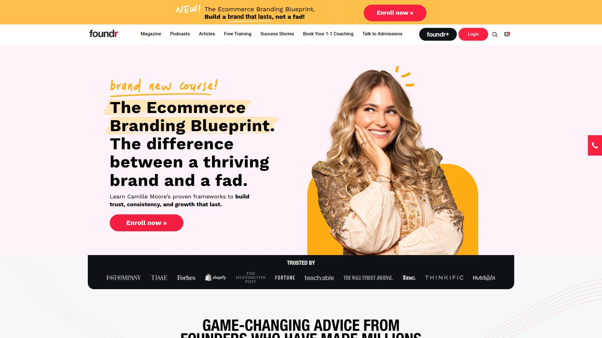

Foundr stands apart by only allowing successful founders to teach—people like Richard Branson, Arianna Huffington, and Mark Cuban who've actually built companies that changed industries. The platform combines a magazine, podcast with 300+ episodes, and over 30 in-depth courses focused entirely on entrepreneurship. What makes Foundr different is the bite-sized learning approach with micro-lessons and plug-and-play templates you can implement immediately.

The courses cover everything from ecommerce store launches to Instagram marketing, with frameworks tested by founders who generated millions in revenue. Foundr+ membership gives access to live coaching, a 30,000+ member community, and actionable checklists that eliminate guesswork. Students report cutting their learning time in half compared to piecing together random YouTube tutorials.

**Who needs this:** First-time founders and solopreneurs who want proven systems from people who've done it, not academics teaching theory. The platform especially shines for ecommerce entrepreneurs with specific courses on product selection, Facebook ads, and brand building. Foundr delivers high-production courses without boring lecture formats—think Netflix quality with business substance.

***

## **[MasterClass](https://masterclass.com)**

Celebrity founders teach business strategy in cinematic video lessons.

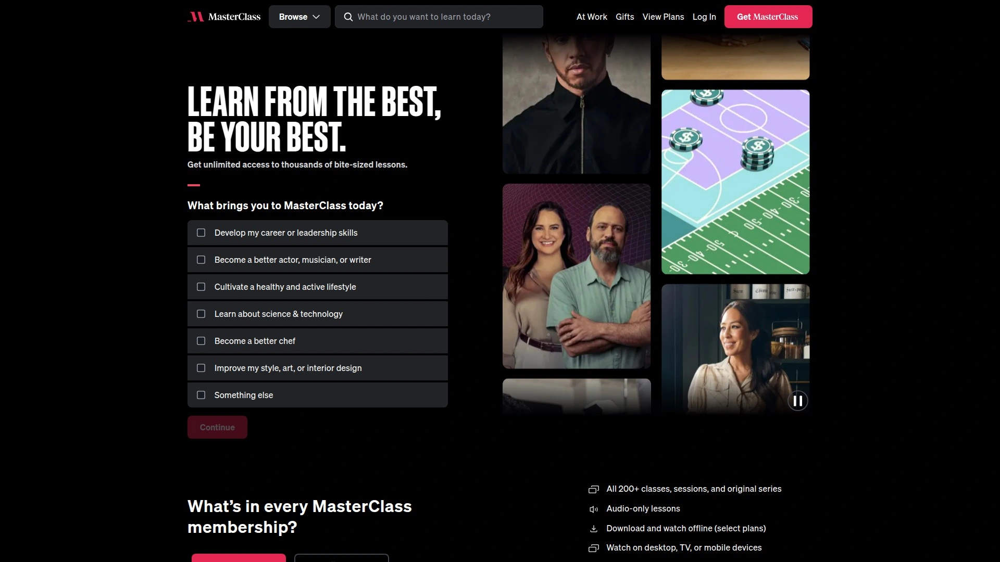

MasterClass brings you inside the minds of billionaire entrepreneurs like Sara Blakely (Spanx), Bob Iger (Disney), and Mark Cuban through beautifully filmed video lessons. The business category covers brand building, negotiation, leadership, innovation, and self-made entrepreneurship. Each class runs 2-5 hours total, broken into 10-20 minute lessons you can watch on any device.

Sara Blakely's course on self-made entrepreneurship walks through bootstrapping Spanx from a $5,000 investment to a billion-dollar company, covering everything from prototype development to pitching retailers. The production quality rivals documentary films, making complex business concepts engaging and memorable.

**Pricing structure:** $120/year for unlimited access to all classes across business, creative arts, cooking, and more. While not as tactical as some platforms, MasterClass excels at mindset shifts and strategic thinking from people who built iconic brands. Best for entrepreneurs who learn from storytelling and want inspiration alongside education.

***

## **[Coursera](https://coursera.org)**

University-level entrepreneurship programs with academic rigor and career credentials.

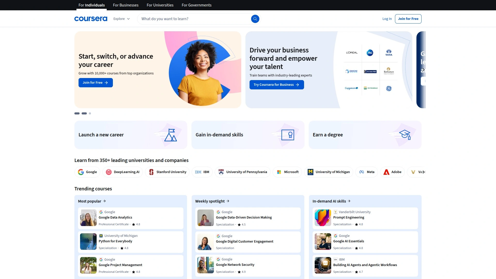

Coursera partners with top universities like Penn's Wharton School, Stanford, and Yale to deliver business courses designed by professors who research entrepreneurship. The Wharton Entrepreneurship Specialization covers opportunity identification, launching ventures, growth strategies, and financing—earning you a certificate recognized by employers worldwide.

**Key advantages:** Courses offer academic depth with case studies, peer reviews, and graded assignments. You can audit most courses free or pay $49-99/month for certificates and full access. Specializations (4-6 course series) provide comprehensive training in specific areas like startup strategy or innovation management.

The platform enrolled over 3 million students in entry-level professional certificates last year, with courses from Google, IBM, and Microsoft adding practical skills to academic foundations. Financial aid covers full tuition for learners who qualify. Best for entrepreneurs who want structured learning with accountability through deadlines and assessments, or those considering MBA programs but wanting lower-cost alternatives first.

***

## **[LinkedIn Learning](https://linkedin.com/learning)**

Professional development courses that credential your profile for potential investors and partners.

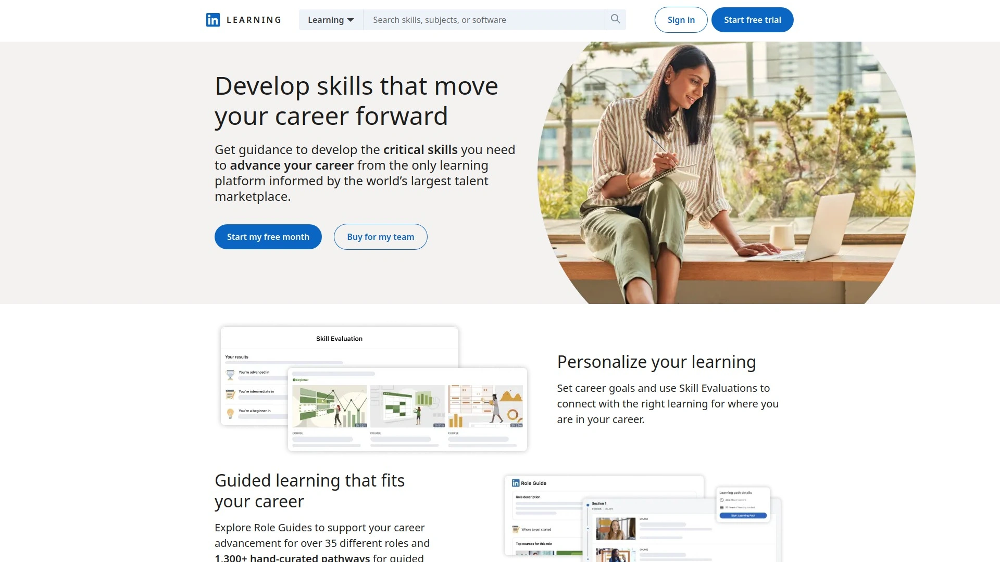

LinkedIn Learning (formerly Lynda.com) offers over 16,000 courses in business, technology, and leadership, with the unique advantage of displaying completed courses directly on your LinkedIn profile. Entrepreneurship courses cover business fundamentals, sales, project management, and leadership—taught by industry practitioners who consult with companies daily.

The integration with LinkedIn means courses like "Entrepreneurship Foundations" or "Starting a Small Business" show up as verified credentials when investors or potential partners view your profile. Courses are organized into learning paths that combine multiple classes for comprehensive skill development.

**Subscription cost:** $29.99/month or $239.88/year for unlimited access. The platform updates content regularly to match current business practices, and you can download courses for offline viewing. Best for entrepreneurs building credibility and networks simultaneously—the professional context matters as much as the content itself.

***

## **[Skillshare](https://skillshare.com)**

Project-based learning with hands-on entrepreneurship assignments and peer feedback.

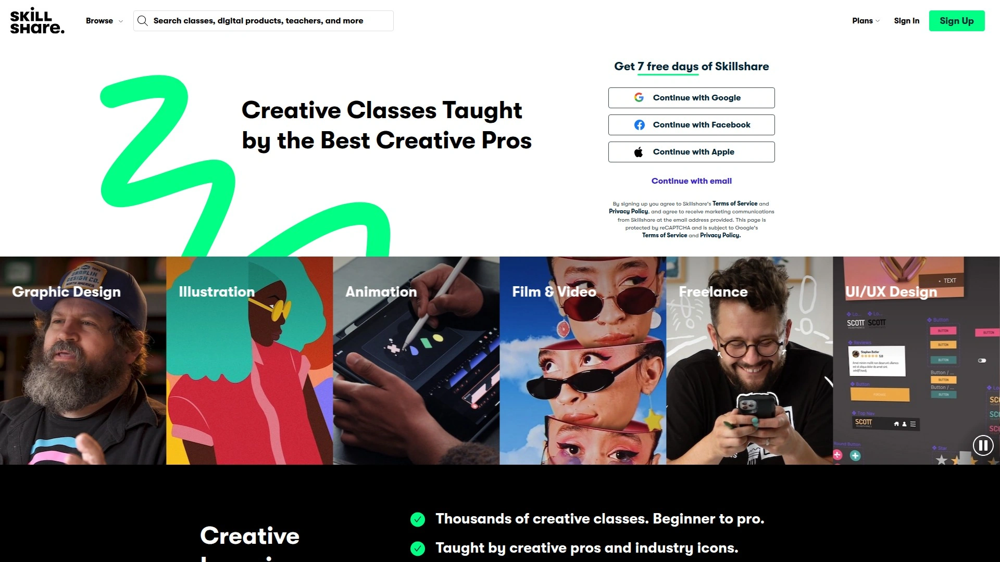

Skillshare's 30,000+ classes take a project-focused approach where you create real deliverables as you learn. Entrepreneurship courses cover business planning, marketing strategy, branding, and product launches—with the twist that you build actual business assets during the class, not just watch lectures.

The "Starting a Business The Right Way" course walks you through frameworks for validating ideas and avoiding common mistakes, with assignments that produce a complete business model canvas by the end. The community aspect lets you share projects and get feedback from instructors and fellow students.

**Pricing:** $99-150/year depending on promotions, with frequent free trial offers (at least 7 days). The platform excels at creative entrepreneurship—if you're launching a design business, content creation service, or product brand, Skillshare connects business fundamentals with creative execution. Best for visual learners who prefer doing over watching.

***

## **[HubSpot Academy](https://academy.hubspot.com)**

Free marketing and sales certifications that teach growth tactics used by successful startups.

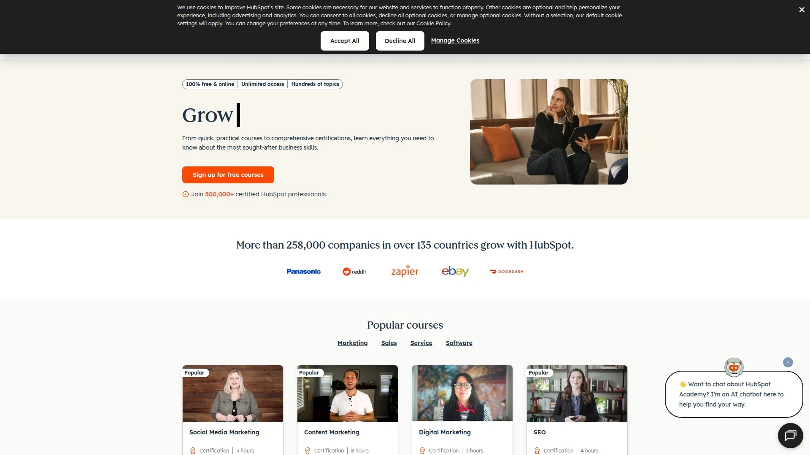

HubSpot Academy provides completely free access to over 500 courses covering inbound marketing, sales development, content marketing, email marketing, SEO, and customer service. The certifications carry weight with employers and clients because they validate practical skills in tools businesses actually use.

**Course highlights:** Digital Marketing certification covers strategy, planning, and execution across channels. Sales training teaches consultative selling techniques. The CRM courses show how to manage customer relationships systematically. Each course combines video lessons, workbooks, and quizzes, with certifications taking 3-6 hours to complete.

Unlike paid platforms, HubSpot Academy focuses specifically on marketing and sales execution—the skills that generate revenue for new businesses. The training aligns with HubSpot's software but teaches universal principles applicable to any tools. Best for bootstrap entrepreneurs who need professional-level marketing training without the price tag, especially service businesses and B2B startups.

***

## **[Y Combinator Startup School](https://startupschool.org)**

Free startup education from the accelerator behind Airbnb, Stripe, and Reddit.

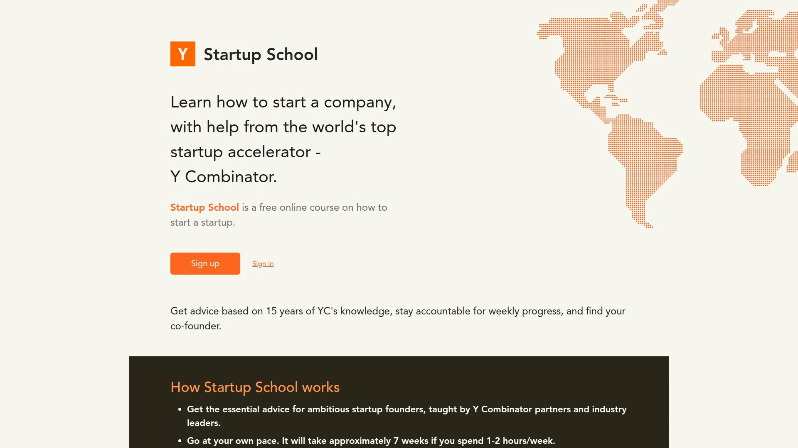

Y Combinator opened its curriculum to everyone through Startup School, a free 7-week online course teaching how to build successful startups. Content comes from YC partners who've advised thousands of founders, covering MVP planning, user growth, fundraising, team leadership, and when to apply to accelerators.

**Standout features:** Sessions include founding stories from Facebook and 23andMe, plus tactical workshops on launching in the press and modern funding strategies. The co-founder matching platform has facilitated over 100,000 matches between potential business partners. A weekly progress tracker keeps you accountable as you build.

The program is asynchronous—go at your own pace while accessing the same knowledge that shaped billion-dollar companies. Unlike most free courses, this isn't watered-down content; it's the actual YC curriculum scaled to reach aspiring founders globally. Best for tech startup founders, especially those considering applying to Y Combinator or other accelerators.

***

## **[Udemy](https://udemy.com)**

Budget-friendly entrepreneurship courses with frequent sales dropping prices to $10-20.

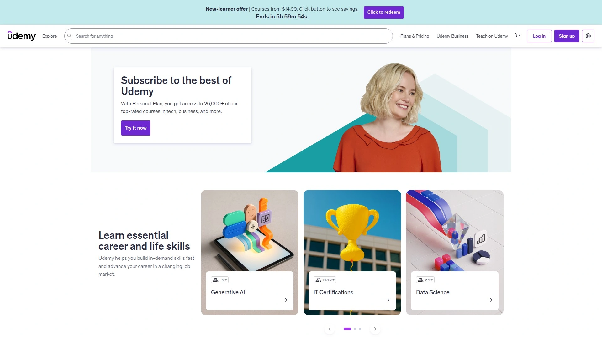

Udemy hosts thousands of business and entrepreneurship courses created by independent instructors, with pricing that makes education accessible to anyone. Courses range from "Complete MBA" programs with 400,000+ students to niche topics like "Amazon FBA Product Launch" or "Freelance Business Fundamentals."

**Shopping strategy:** Never pay full price—Udemy runs constant sales with courses dropping from $199.99 to $11.99-19.99. Look for courses with 50,000+ enrollments and 4.5+ star ratings with thousands of reviews. Check curriculum length (prefer 10+ hours) and recent updates (within 12 months).

Quality varies significantly since anyone can publish, but highly-rated courses often match paid platforms in depth. Once purchased, you own lifetime access with no subscriptions. The mobile app lets you download courses for offline learning during commutes. Best for self-directed learners on tight budgets who can evaluate quality themselves through preview videos and detailed reviews.

***

## **[General Assembly](https://generalassemb.ly)**

Intensive bootcamps and workshops for entrepreneurs pivoting into tech-enabled businesses.

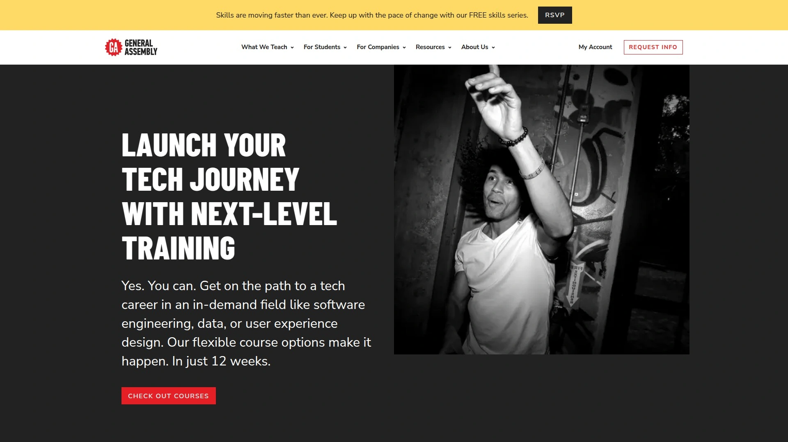

General Assembly delivers immersive bootcamps and part-time courses in coding, data analytics, UX design, digital marketing, and product management—skills increasingly essential for modern entrepreneurs. Programs run 10-12 weeks full-time or 24 weeks part-time, with campuses worldwide plus online options.

**Business applications:** The Digital Marketing bootcamp teaches acquisition strategies, analytics, and campaign optimization. Product Management courses prepare founders to lead technical teams and prioritize features. UX Design training helps entrepreneurs create user-friendly products without hiring expensive designers initially.

Tuition ranges $3,950-15,950 depending on the program, with financing options and income share agreements available. General Assembly emphasizes career outcomes with personalized coaching, hiring partner networks, and portfolio projects. Best for entrepreneurs building tech products or digital businesses who need intensive skill development in specific disciplines.

***

## **[edX](https://edx.org)**

University business degrees and MicroMasters from MIT, Harvard, and Columbia online.

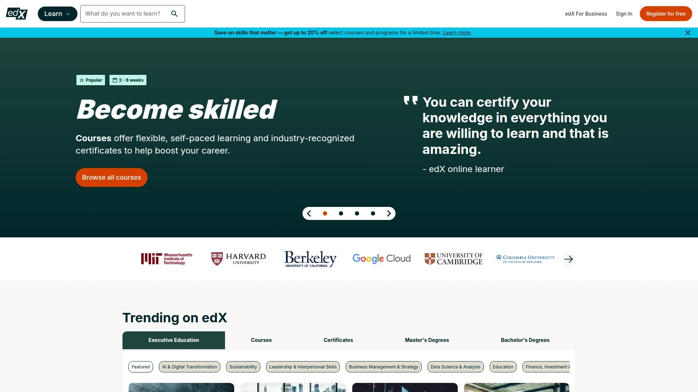

edX partners with universities to offer everything from free courses to full bachelor's and master's degrees in business, including MBAs from institutions like Boston University and LSE. MicroMasters programs provide graduate-level credentials in fields like Business Analytics or Corporate Entrepreneurship for $1,000-1,500 total.

**Academic paths:** Audit courses free to learn without certificates. Verified certificates cost $49-199 per course. Professional Certificate programs bundle 3-6 courses for $300-900. Full degrees cost $10,000-25,000—significantly less than on-campus equivalents.

The "Entrepreneurship 1: Developing the Opportunity" course from Penn teaches market analysis and product development using case studies and frameworks from Wharton professors. MIT's entrepreneurship courses starting regularly cover everything from idea validation to scaling operations. Best for entrepreneurs seeking academic credentials alongside knowledge, or those planning eventual MBA programs but wanting foundations first.

***

## **[GrowthX Academy](https://growthx.club)**

Specialized training in growth marketing, UX design, and sales from startup practitioners.

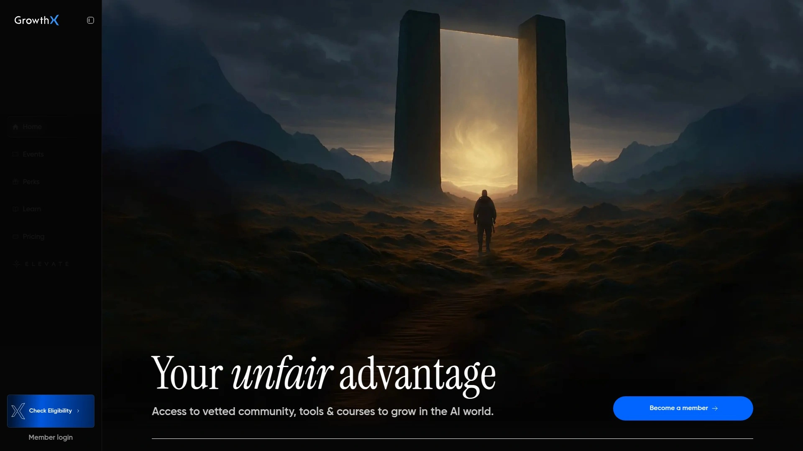

GrowthX Academy focuses on three specific disciplines crucial for startup success: growth marketing for customer acquisition, UX design for product development, and sales/business development for revenue generation. Courses run 8-16 weeks self-paced online, taught by entrepreneurs and founders who built real businesses.

**Curriculum focus:** Growth Marketing covers customer acquisition, analytics, and technology tools. UX Design teaches research, structure, and interface design without requiring coding skills. Sales training emphasizes lean startup principles, unit economics, and customer psychology.

The instructors are practitioners currently running businesses, not just theorists. Course content emphasizes frameworks and mindsets for operating in competitive environments rather than just tactics. Best for entrepreneurs who've validated ideas and need specific skills in growth, design, or sales to scale—or professionals transitioning into startup roles.

***

## **[FutureLearn](https://futurelearn.com)**

International university entrepreneurship courses with global business perspectives.

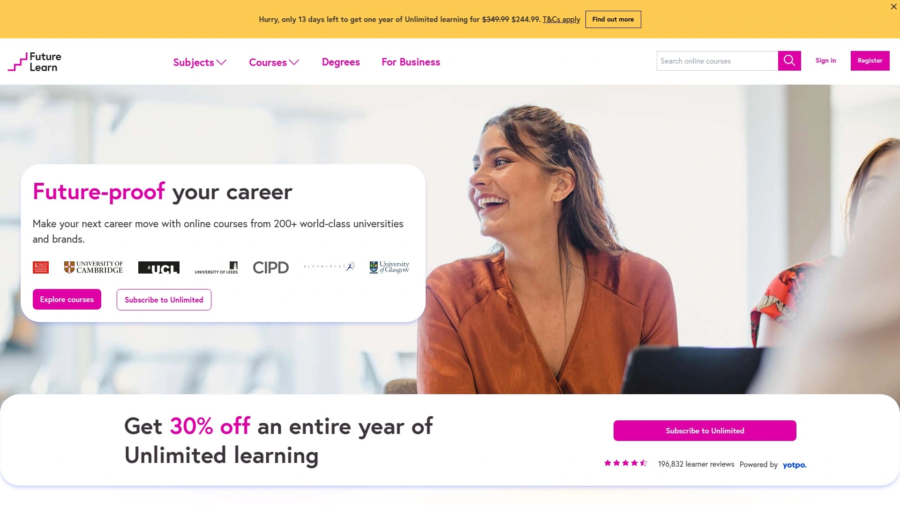

FutureLearn partners with universities and institutions worldwide to offer entrepreneurship courses emphasizing international contexts and diverse business ecosystems. Courses like "Entrepreneurship: From Business Idea to Action" include case studies from MENA region businesses and global enterprises, teaching how concepts apply across different markets.

**Learning approach:** Courses run 3-6 weeks with 3-4 hours weekly commitment. Content mixes videos, articles, and peer discussions in a social learning environment. Premium courses provide unlimited access, tests, and Certificates of Achievement for $39-79.

The "Innovation and Entrepreneurship for a New Business" course covers theoretical and practical knowledge with critical thinking applied to contemporary cases. "Start a Business: A Practical Guide to Entrepreneurial Success" walks through planning, development, and launch stages with global examples. Best for entrepreneurs targeting international markets or those wanting exposure to business practices beyond Western contexts.

***

## **[Udacity](https://udacity.com)**

Tech-focused Nanodegrees teaching skills for building digital products and data-driven businesses.

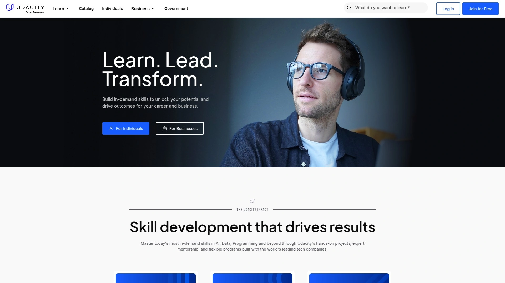

Udacity specializes in technology education through Nanodegree programs in data science, programming, AI, cloud computing, and digital marketing. Programs are self-paced but structured with 5-10 hour weekly commitments over approximately six months, designed by industry professionals from Google, IBM, and leading tech companies.

**Entrepreneurship angle:** Digital Marketing Nanodegree teaches acquisition, conversion, and analytics for online businesses. Data Analyst training helps founders make data-driven decisions. Programming Nanodegrees enable non-technical founders to build MVPs themselves or speak credibly with development teams.

Pricing runs $399-1,500 depending on the program, with monthly subscription options and occasional scholarships from tech companies. 24/7 mentor support helps with technical questions and code reviews. Career coaching and resume feedback support job seekers, though entrepreneurs benefit from the hard skills more than career services. Best for tech entrepreneurs who need specific technical capabilities to build or grow digital products.

***

## **[altMBA](https://altmba.com)**

Seth Godin's intensive 4-week leadership workshop for entrepreneurs making bold moves.

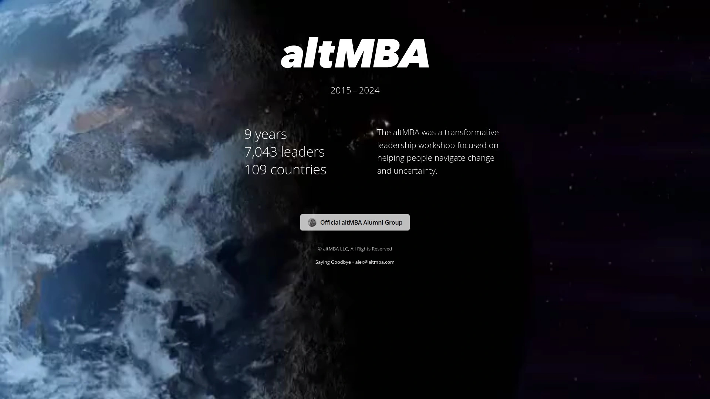

altMBA delivers an intense online leadership and management experience created by bestselling author Seth Godin for "ruckus makers" ready to lead change. The 4-week program engages 100+ students from 27+ countries through 13 assigned projects published publicly, with coaches providing individual and group feedback via Slack, WordPress, and Zoom.

**Program intensity:** Over 50,000 messages exchanged between students and coaches in single sessions. Synchronous learning with regular deadlines, group discussions, and video calls creates accountability and momentum. Past participants include leaders from Nike, Microsoft, Kickstarter, Coca-Cola, and nonprofits like charity:water.

Tuition costs $3,000 for the immersive experience. Unlike typical courses, altMBA focuses on leadership mindset and organizational change rather than tactical business skills. The program suits entrepreneurs at inflection points—scaling teams, shifting strategies, or transforming company culture. Best for established founders ready to level up leadership capabilities rather than first-time entrepreneurs still learning business basics.

***

## FAQ

**Which platform offers the best value for bootstrapped entrepreneurs?**
HubSpot Academy provides completely free marketing and sales certifications that teach revenue-generating skills immediately applicable to new businesses. For broader business education on a budget, Udemy courses during sales ($10-20) deliver comprehensive content with lifetime access. Y Combinator Startup School offers world-class startup training free, though it focuses specifically on tech ventures rather than general small businesses.

**Do I need different platforms for different business stages?**
Yes—early-stage founders benefit from Foundr or Y Combinator Startup School for validation and launch frameworks. Growth-stage entrepreneurs need specialized training from LinkedIn Learning or GrowthX Academy in marketing, sales, or product management. Established founders scaling teams should consider altMBA or executive education from Coursera/edX for leadership development and strategic thinking.

**Can online courses replace traditional MBA programs for entrepreneurs?**
Online platforms provide tactical skills and frameworks faster and cheaper than MBAs, but lack the network access and credential recognition that traditional programs offer for corporate careers or fundraising. Entrepreneurs building businesses benefit more from practical platforms like Foundr or HubSpot Academy that teach execution over theory. However, edX and Coursera now offer accredited online MBAs at 50-70% lower cost than on-campus programs if credentials matter for your specific goals.

---

## Conclusion

The entrepreneurship education platform you choose depends on your business stage and learning style—early founders need validation frameworks from Y Combinator or Foundr, while scaling companies require specialized training from LinkedIn Learning or General Assembly. For most aspiring entrepreneurs seeking comprehensive, action-oriented training from successful founders rather than academics, **[Foundr](https://foundr.com)** delivers the strongest combination of proven frameworks, high-quality production, and plug-and-play templates that eliminate months of trial and error. The platform's exclusive focus on letting only successful founders teach ensures you learn from people who've navigated the exact challenges you're facing now.
